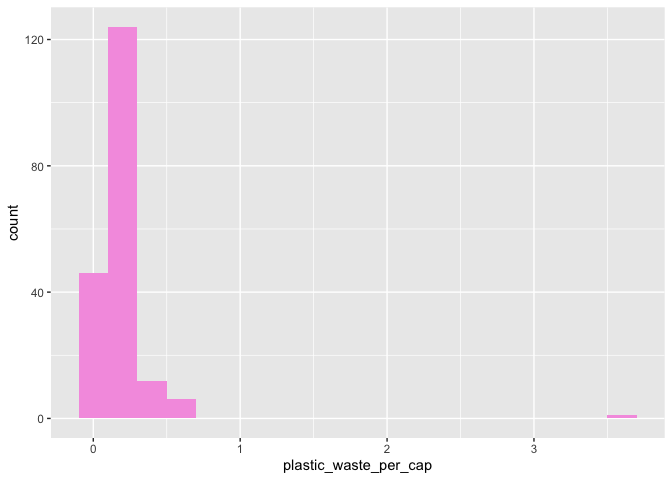
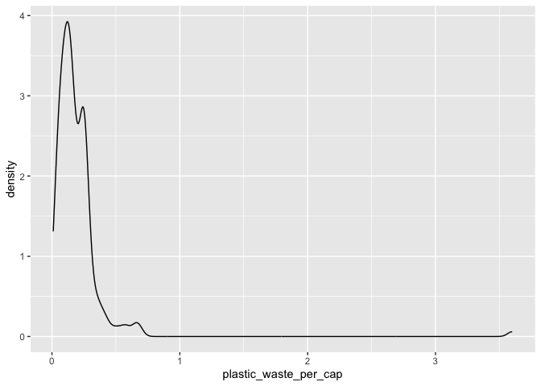
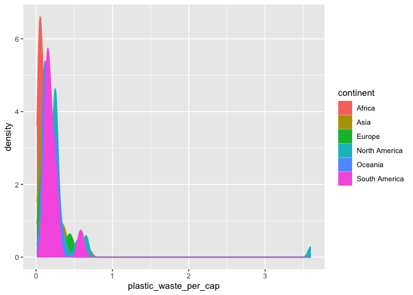
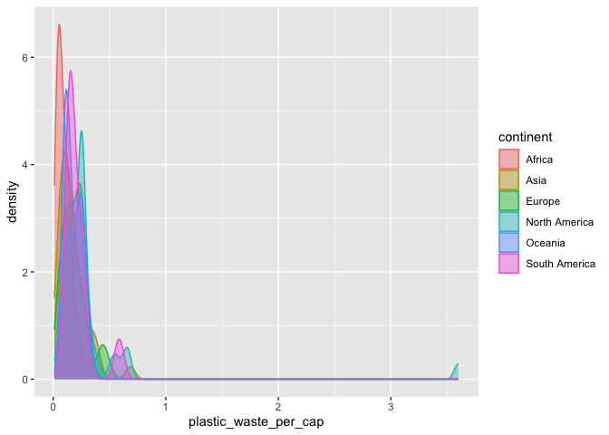
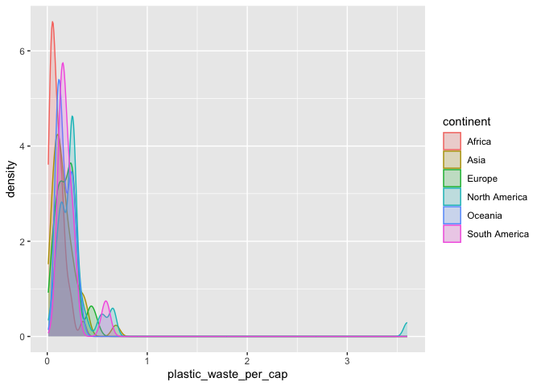
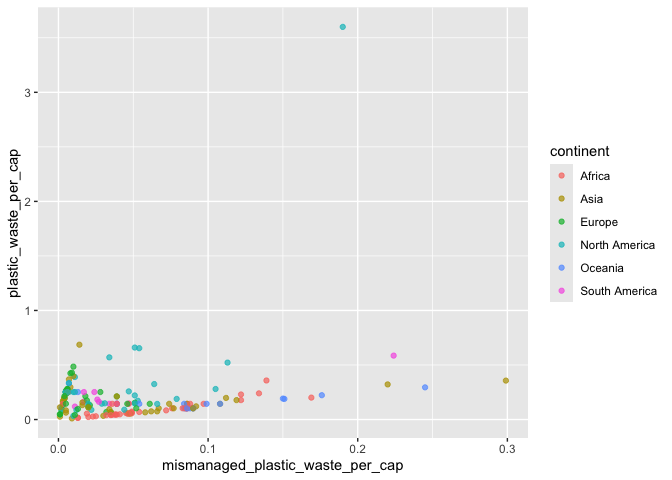
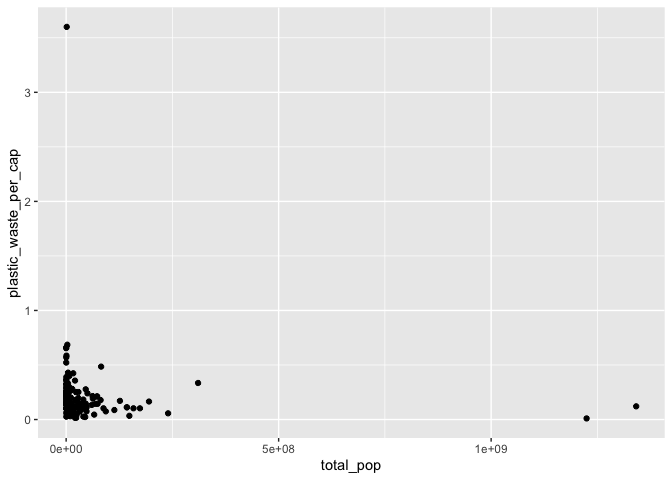
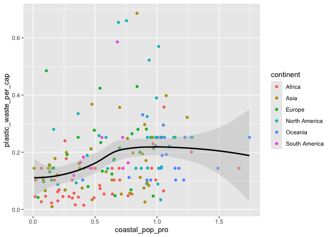

Lab 02 - Plastic waste
================
Cynthia Jiao
1/22/2025

## Load packages and data

``` r
library(tidyverse) 
```

``` r
plastic_waste <- read.csv("data/plastic-waste.csv")
```

## Warm up

1.  Source: Write and edit scripts.
2.  Console: Run code and see output.
3.  Environment: View loaded objects
4.  Plots/Packages/Help: view plots, packages, and search for package
    instructions.

There are 240 observations and 10 variables. NA represents missing data.

## Exercises

### Exercise 1

Plot histogram

``` r
ggplot(data = plastic_waste, aes(x = plastic_waste_per_cap)) +
  geom_histogram(binwidth = 0.2, fill = "#f59fe1") # I changed the bar color to barbie pink:)
```

    ## Warning: Removed 51 rows containing non-finite outside the scale range
    ## (`stat_bin()`).

<!-- -->

``` r
plastic_waste %>%
  filter(plastic_waste_per_cap > 3.5)
```

    ##   code              entity     continent year gdp_per_cap plastic_waste_per_cap
    ## 1  TTO Trinidad and Tobago North America 2010    31260.91                   3.6
    ##   mismanaged_plastic_waste_per_cap mismanaged_plastic_waste coastal_pop
    ## 1                             0.19                    94066     1358433
    ##   total_pop
    ## 1   1341465

I am surprised that Trinidad and Tobago is the country with the highest
plastic waste per capita, so I google and a few reports from UN show
consistent evidence that carribean countries, especially Trinidad and
Tobago, waste huge amount of plastics due to building oceanfront hotels,
shops, and housing.

Plot density plot

``` r
ggplot(
  data = plastic_waste,
  aes(x = plastic_waste_per_cap)
) +
  geom_density()
```

    ## Warning: Removed 51 rows containing non-finite outside the scale range
    ## (`stat_density()`).

<!-- -->

``` r
#compare across continents

ggplot(
  data = plastic_waste,
  mapping = aes(
    x = plastic_waste_per_cap,
    color = continent
  )
) +
  geom_density()
```

    ## Warning: Removed 51 rows containing non-finite outside the scale range
    ## (`stat_density()`).

<!-- -->

``` r
#fill the density plot

ggplot(
  data = plastic_waste,
  mapping = aes(
    x = plastic_waste_per_cap,
    color = continent,
    fill = continent
  )
) +
  geom_density()
```

    ## Warning: Removed 51 rows containing non-finite outside the scale range
    ## (`stat_density()`).

<!-- -->

``` r
#fill with transparent colors

ggplot(
  data = plastic_waste,
  mapping = aes(
    x = plastic_waste_per_cap,
    color = continent,
    fill = continent
  )
) +
  geom_density(alpha = 0.7)
```

    ## Warning: Removed 51 rows containing non-finite outside the scale range
    ## (`stat_density()`).

<!-- -->

### Exercise 2

Density plot with different transparency

``` r
ggplot(
  data = plastic_waste,
  mapping = aes(
    x = plastic_waste_per_cap,
    color = continent,
    fill = continent
  )
) +
  geom_density(alpha = 0.4)
```

    ## Warning: Removed 51 rows containing non-finite outside the scale range
    ## (`stat_density()`).

<!-- -->

``` r
ggplot(
  data = plastic_waste,
  mapping = aes(
    x = plastic_waste_per_cap,
    color = continent,
    fill = continent
  )
) +
  geom_density(alpha = 0.2)
```

    ## Warning: Removed 51 rows containing non-finite outside the scale range
    ## (`stat_density()`).

<!-- --> It
seems that when alpha = 0.2, it is easier to tell density curves for all
continents, but regardless, South America curves overlap with most
portions of Asia, North America, and Oceania, making it hard to see all
continents clearly.

Color and fill are inside aes() because they depend on the data
(continent), while alpha is set outside as a fixed property because it
applies to the whole density plot (all density curves).

### Exercise 3

Boxplot and violin plot

``` r
ggplot(
  data = plastic_waste,
  mapping = aes(
    x = continent,
    y = plastic_waste_per_cap
  )
) +
  geom_boxplot()
```

    ## Warning: Removed 51 rows containing non-finite outside the scale range
    ## (`stat_boxplot()`).

<!-- -->

``` r
#converting to violin plot

ggplot(
  data = plastic_waste,
  mapping = aes(
    x = continent,
    y = plastic_waste_per_cap
  )
) + 
  geom_violin()
```

    ## Warning: Removed 51 rows containing non-finite outside the scale range
    ## (`stat_ydensity()`).

<!-- -->
The box plot shows the min, max, medium, and mean for each continent
group. The violin plot shows not only these values but also the
distribution of plastic waste per capita for all countries within each
continent group.

### Exercise 4

Scatter plot where x and y is mismanaged plastic waste per capita and
plastic waste per capita.

``` r
ggplot(
  data = plastic_waste,
  mapping = aes(
    x = mismanaged_plastic_waste_per_cap,
    y = plastic_waste_per_cap
  )
) + 
  geom_point()
```

    ## Warning: Removed 51 rows containing missing values or values outside the scale range
    ## (`geom_point()`).

<!-- -->
From the plot, it seems that there is a small to medium positive, linear
relationship between x and y, such that when there is more mismanaged
plastic waste per capita, there is more plastic waste per capita.

Scatter plot where x and y is mismanaged plastic waste per capita and
plastic waste per capita, with continent colored.

``` r
ggplot(
  data = plastic_waste,
  mapping = aes(
    x = mismanaged_plastic_waste_per_cap,
    y = plastic_waste_per_cap,
    color = continent,
    fill = continent
  )
) + 
  geom_point(alpha = 0.7)
```

    ## Warning: Removed 51 rows containing missing values or values outside the scale range
    ## (`geom_point()`).

<!-- -->
From the plot, it seems that in all continents mismanaged plastic waste
per capita has a positive, linear relationship with plastic waste per
capita. However, the relationship varies in strength depending on the
continent. For example, the relationship is very strong for Europe, but
weaker for Asia.

``` r
ggplot(
  data = plastic_waste,
  mapping = aes(
    x = total_pop,
    y = plastic_waste_per_cap
  )
) + 
  geom_point()
```

    ## Warning: Removed 61 rows containing missing values or values outside the scale range
    ## (`geom_point()`).

<!-- -->
This plot seems to show a very weak and negative relationship between
total population and waste per capita.

``` r
ggplot(
  data = plastic_waste,
  mapping = aes(
    x = coastal_pop,
    y = plastic_waste_per_cap
  )
) + 
  geom_point()
```

    ## Warning: Removed 51 rows containing missing values or values outside the scale range
    ## (`geom_point()`).

<!-- -->
This plot also seems to show a very weak and negative relationship
between coastal population and waste per capita. However, the
relationship between plastic waste per capita and coastal population
appears slightly stronger than the relationship with total population.
In the coastal population plot, the data points seem to follow a more
consistent pattern, with fewer extreme outliers and a relatively clearer
negative trend.

### Exercise 5

``` r
# Compute new variable

library(dplyr)

plastic <-plastic_waste %>%
  filter(plastic_waste_per_cap < 3)

plastic_final <- plastic %>%
  mutate(coastal_pop_pro = plastic$coastal_pop/plastic$total_pop)


ggplot(
  data = plastic_final,
  mapping = aes(
    x = coastal_pop_pro,
    y = plastic_waste_per_cap,
    color = continent,
    fill = continent
  )
) + 
  geom_point() +
  geom_smooth(mapping = aes(x = coastal_pop_pro, y = plastic_waste_per_cap), 
              method = "loess",  # Linear regression line
              color = "black",  # Set to black for the single line
              fill = "gray",
              se = TRUE)
```

    ## `geom_smooth()` using formula = 'y ~ x'

    ## Warning: Removed 10 rows containing non-finite outside the scale range
    ## (`stat_smooth()`).

    ## Warning: Removed 10 rows containing missing values or values outside the scale range
    ## (`geom_point()`).

<!-- -->
